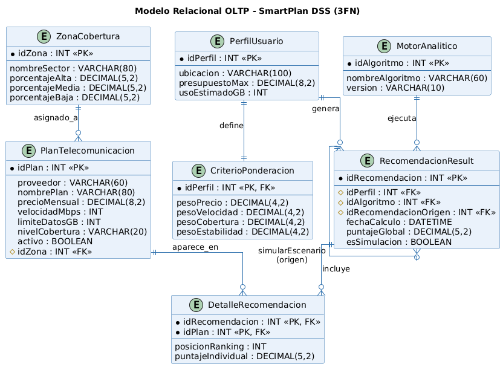
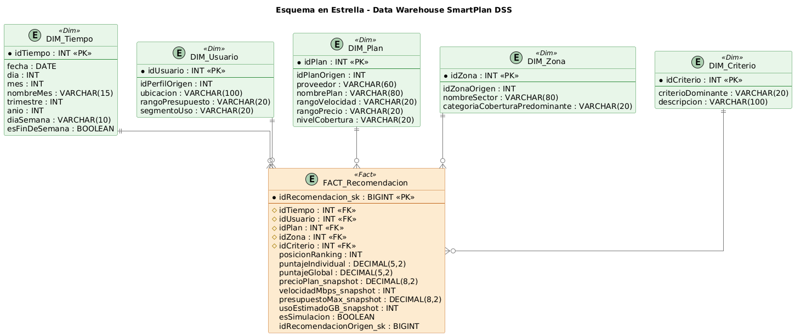

# Base de Datos – SmartPlan DSS

Esta carpeta contiene los modelos de datos del proyecto: la base transaccional
(OLTP) que soporta el CRUD, y el Data Warehouse (DW) que soporta el análisis
y las recomendaciones del DSS.

## 1. Modelo OLTP (Transaccional)

Modelo relacional normalizado (3FN), derivado del diagrama de clases de la
Actividad 4. Soporta las operaciones diarias de captura: gestión del catálogo
de planes, perfiles de usuario, criterios de ponderación y el historial de
recomendaciones (incluyendo simulaciones, HU-03).

Código fuente: [`diagrama_oltp.puml`](diagrama_oltp.puml)

## 2. Data Warehouse (Esquema en Estrella)

Modelo dimensional desnormalizado, optimizado para consultas analíticas.
Tabla de hechos `FACT_Recomendacion` (grano: un plan recomendado dentro de
una posición del ranking, en una recomendación puntual) rodeada de las
dimensiones Tiempo, Usuario, Plan, Zona y Criterio.

Código fuente: [`diagrama_dw_estrella.puml`](diagrama_dw_estrella.puml)

## 3. Script SQL

[`smartplan_dss_schema.sql`](smartplan_dss_schema.sql) contiene el DDL
completo (`CREATE TABLE`) de ambos modelos, con sus llaves primarias,
foráneas y restricciones (`CHECK`), más consultas de ejemplo para los 3 KPIs
del negocio.

## Diferencia entre OLTP y Data Warehouse

El modelo **OLTP** está normalizado para garantizar integridad y eficiencia
en operaciones CRUD frecuentes de bajo volumen (crear un plan, registrar un
perfil, guardar una recomendación puntual). El **Data Warehouse**, en cambio,
está intencionalmente desnormalizado en un Esquema en Estrella, optimizado
para consultas analíticas de lectura masiva: una tabla de hechos compacta
con métricas numéricas, rodeada de dimensiones anchas con texto descriptivo,
lo que reduce los JOINs necesarios y acelera el reporting gerencial.
